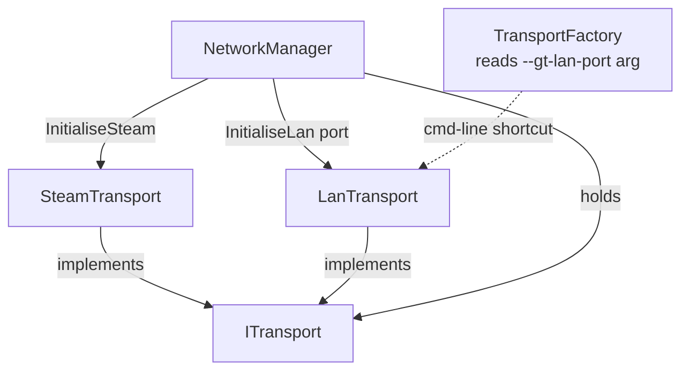
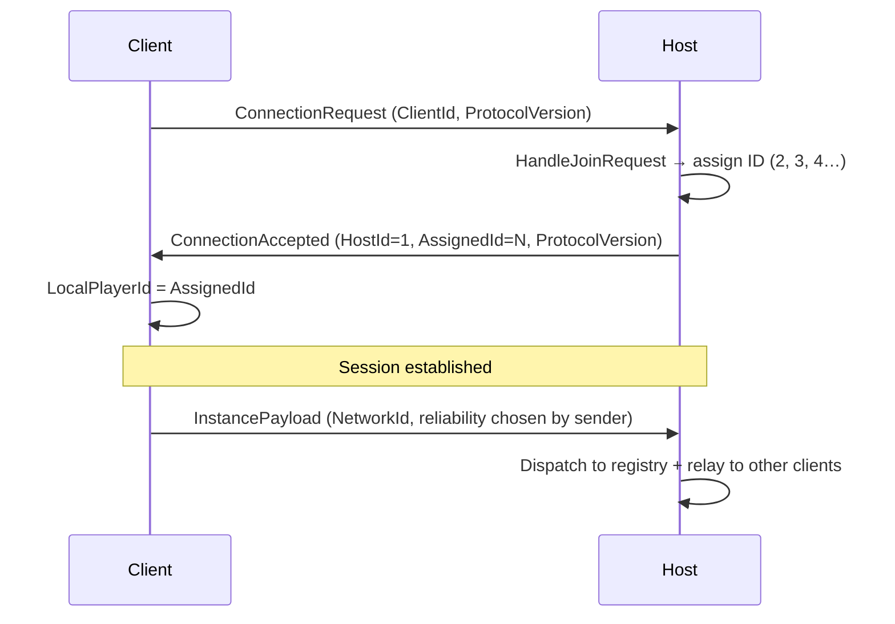
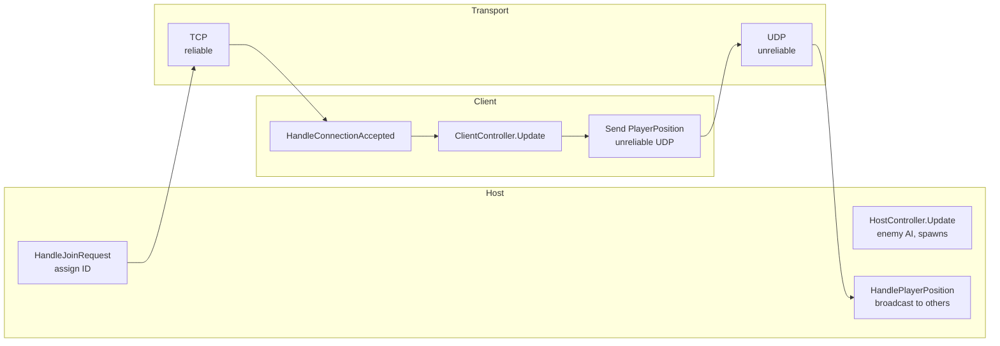
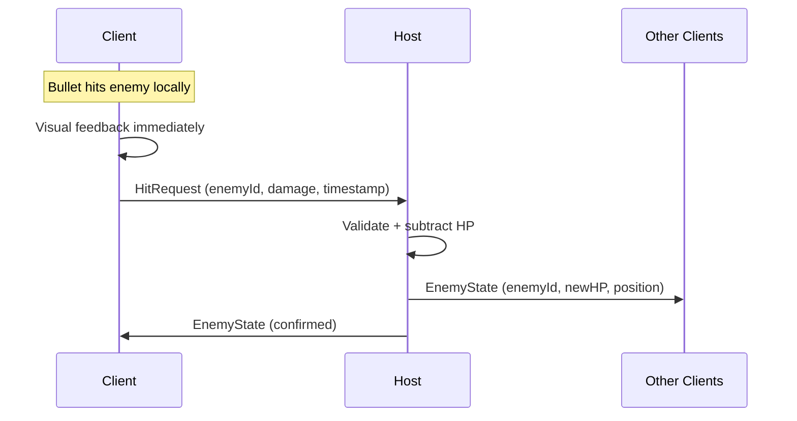
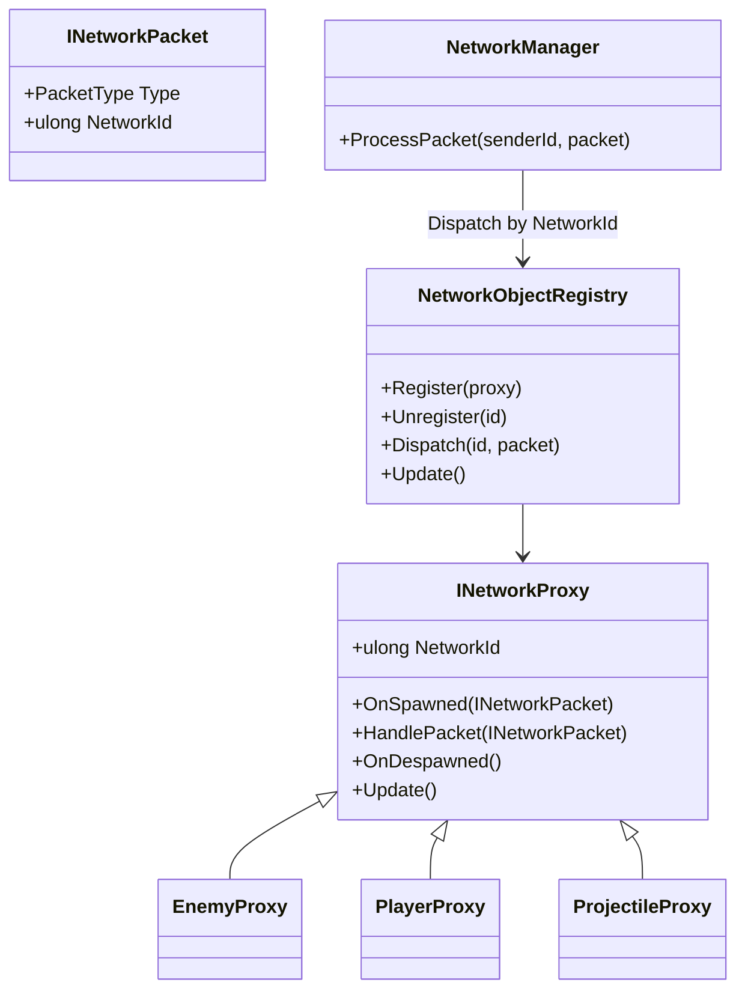
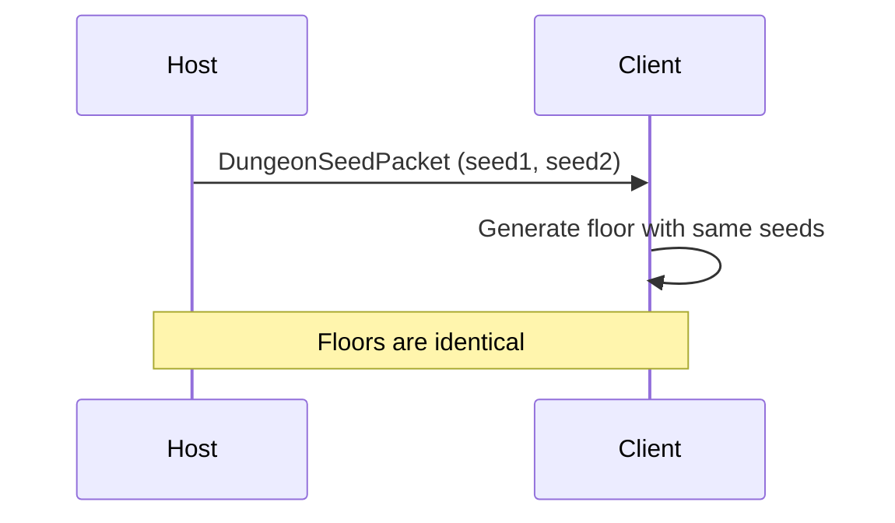

# GungeonNearby — Network Architecture

## Overview

Host-client topology. The **host** runs all authoritative game logic (enemy AI, HP, dungeon generation). **Clients** hold proxy/ghost objects that mirror host state. Client-side prediction is used for hit detection only — damage is always confirmed by the host.

---

## Transport Layer

`LanTransport` uses **TCP** for reliable packets (handshake, damage) and **UDP** for unreliable packets (position). Background threads receive into a queue; `Update()` dispatches on the Unity main thread.

---

## Session Handshake

Host is always player ID **1**. Each joining client gets a sequentially assigned ID starting at **2**.

---

## Packet Flow (runtime)

---

## Hit Detection (designed, not yet implemented)

Client-side prediction: if a bullet hits on YOUR screen, you report it. Host is authoritative on HP. Same rule applies in reverse — you only take damage if the bullet hits you on your own screen, then report to host.

---

## Proxy / Network Object Registry

Each networked packet carries a **NetworkId** (0 = system packet, non-zero = entity packet). `NetworkManager` routes entity packets to the registry by `NetworkId` without inspecting the payload. The registered proxy receives the packet and casts to its own type. If no proxy is registered for a given `NetworkId`, an error is logged — spawning is the game layer's responsibility, not the network layer's.

---

## Dungeon Sync (designed, not yet implemented)

Host sends two seeds to clients before floor generation begins. Generation is deterministic given the same seeds, so no further map data needs to be transmitted.

---

## What is implemented today

| Feature | Status |
|---|---|
| ITransport abstraction | ✅ |
| SteamTransport (P2P via reflection) | ✅ |
| LanTransport (TCP + UDP) | ✅ |
| UGUI overlay panel (Main / Steam / LAN) | ✅ |
| Session handshake (ConnectionRequest / Accepted) | ✅ |
| Host-assigned player IDs | ✅ |
| InstancePayload packets routed by NetworkId | ✅ |
| Host relay to other clients | ✅ |
| Ghost player GameObjects + interpolation | ❌ |
| Network object registry / proxy system | ✅ |
| Hit request / host-authoritative HP | ❌ |
| Enemy sync | ❌ |
| Dungeon seed sync | ❌ |
| SessionStatePacket (late-join state dump) | ❌ |
